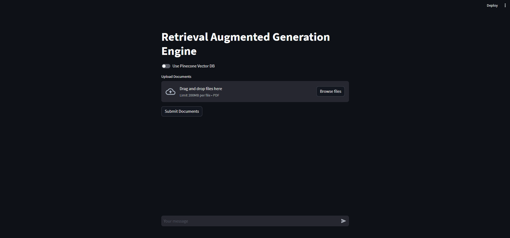

# 🚀 Retrieval Augmented Generation Engine with a Splash of LangChain, Streamlit, & Pinecone Magic! 🎩✨

[🎉 Take a ride to our app on the Streamlit Cloud Platform! 🎠](https://wyn-rag.streamlit.app/)

## 🌈 Overview

Meet RAG! The Retrieval Augmented Engine 🎡. Think of it as your magical librarian 🧙‍♂️. It fetches documents, summarizes them, and even chats with you about them! 📚✨ With a sprinkle of LangChain, a dash of Streamlit, and a touch of Pinecone, we've whipped up a web potion for you! 🍹 Upload all your mystical PDFs 📜, chat with them 🗣, and let's make some magic! 🌟 And guess what? RAG remembers all your magical conversations! 💌

## ✨ Features

- **Streamlit Web Potion** 🍾: Brewed with Streamlit! It's web magic at your fingertips! 🌐✨
- **Secret Keyholes 🗝**: Whisper your OpenAI & Pinecone secrets into our enchanted input fields! 🤫
- **Document Portal 🌀**: Send your PDF scrolls into our world for some spellbinding analysis! 🪄
- **Document Slicing 🔪**: We magically slice your big scrolls into bite-sized pieces, so they play nice with our spells! 🍰
- **Vector Elixirs 🍶**: We turn text chunks into magical vector potions for some epic quest-answering! 🎯
- **Choose Your Vector Vault 🗃**: Hide your vectors in Pinecone's treasury or keep them in your backyard! You decide! 🛡
- **Chit-Chat Cauldron 🗨**: Talk to your docs, ask them riddles, and they'll whisper secrets back! 📖💬 And your magical chats? We've got them saved in our crystal ball! 🔮

## 📜 To Get Started...

Before you embark on this quest, gather these artifacts 🎒:

- A flask of Python 3.7+ potion 🍾
- A shard of LangChain 🌌
- A sprinkle of Streamlit 🌠
- A pinecone... err, I mean, Pinecone! 🌲
- Your OpenAI spellbook key 🗝
- Scrolls (or PDFs, as the mortals call them) 📜

## 👩‍🎤👨‍🎤 The Enchanters

🌟 [Yiqiao Yin, the Digital Mage](https://github.com/yiqiao-yin) 🌟

Let the magic begin! 🎉🎩✨